# Examen GIT

*Por Marcos Rivero Zarco*

Para empezar a trabajar he tenido que clonar mi repositorio de github con el siguiente comando:
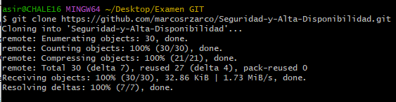

Me he movido a la carpeta correspondiente y he empezado a hacer las configuraciones básicas (user.name y user.email):
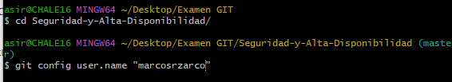
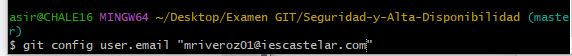

He creado un directorio dentro del repositorio solo para el examen:
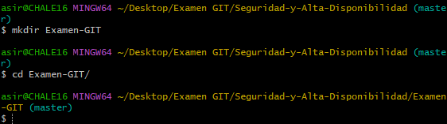

He creado este readme:
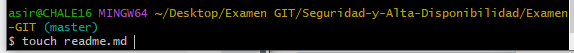
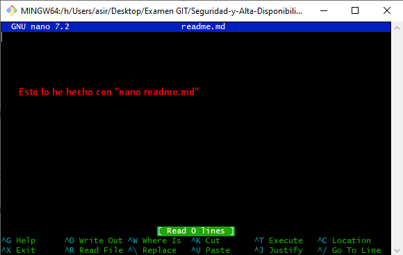

He creado el archivo dos.txt:
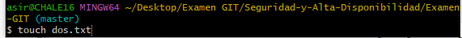

Ahora he creado el archivo uno.md pero además para que no sea trackeado he tenido que crear también un .gitignore donde he escrito el nombre de uno.md:
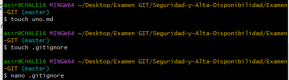
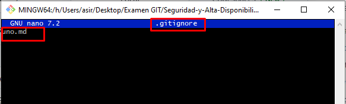

Para verificar que funciona:
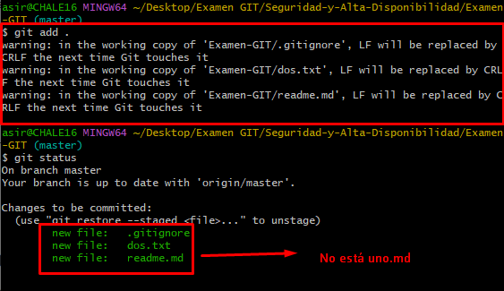

Esto no lo he comentado al principio pero es importante saber que en caso que no tengamos un repositorio remoto linkeado hay que hacerlo y ponerle un nombre (que por lo general es origin):
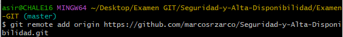

Con este comando publico los cambios en github:

Ahora voy a modificar el archivo dos.txt:
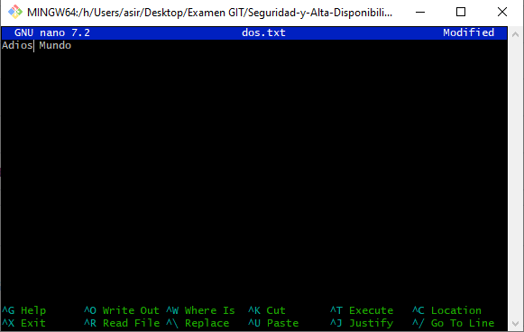
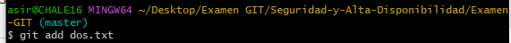

Aquí compruebo que git está reconociendo las modificaciones:
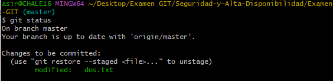
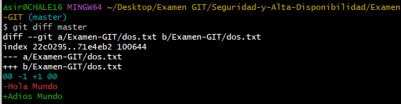

Para restaurar el archivo y volver a su estado anterior el propio git te ayuda diciéndote como hacerlo:
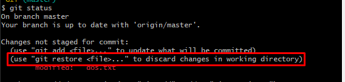
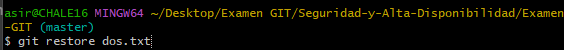
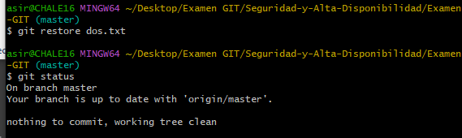

Ahora dos.txt sigue estando como en nuestra primera versión y ningún cambio se ha consolidado.
