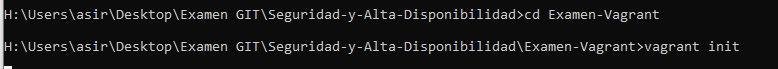
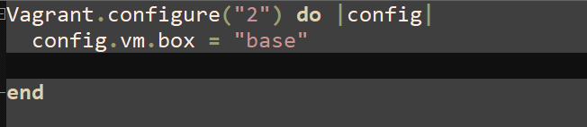
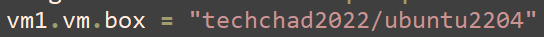
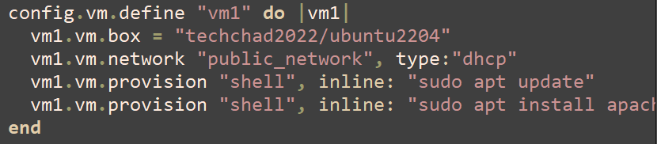
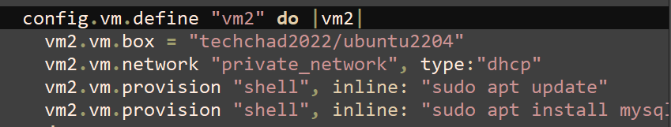
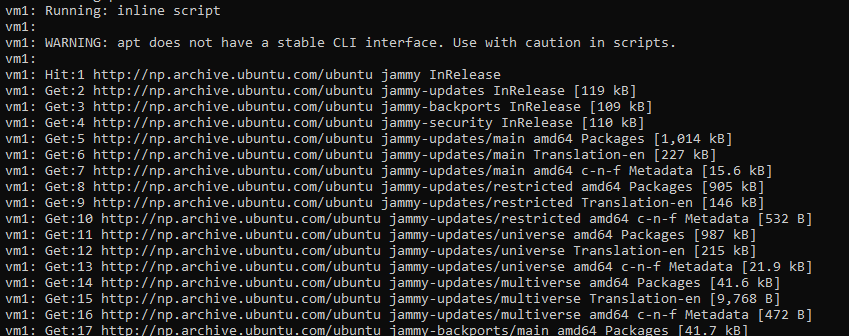
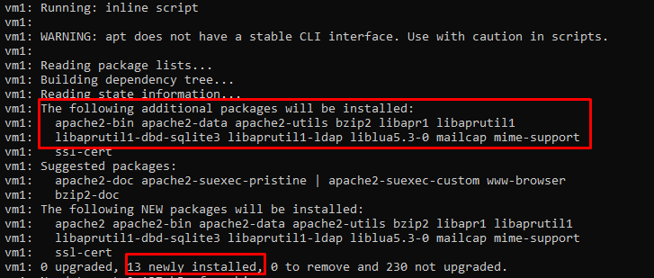

# Examen GIT

*Por Marcos Rivero Zarco*

Para empezar tenemos que tener un vagrantfile, que vamos a crear con vagrant init.

Esta es la  configuración que viene en el archivo por defecto (he borrado los comentarios de autodocumentación):

He cambiado (en ambas máquinas) el box por uno de ubuntu 22.04.

También he hecho un aprovisionamiento para que se ejecuten los comandos que descargarán e instalarán los paquetes deseados. 

Aquí se puede ver que funciona:

