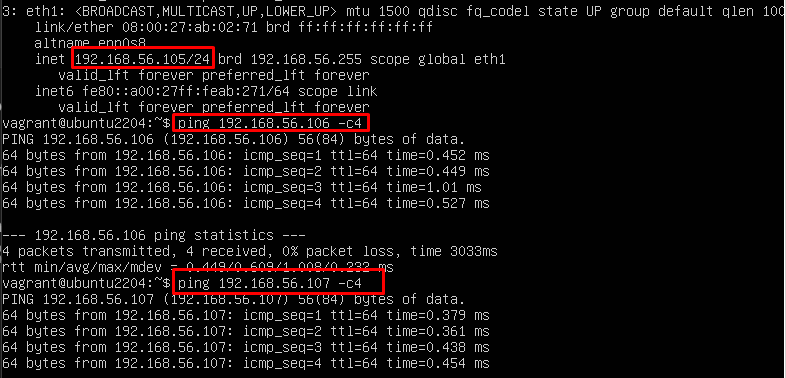
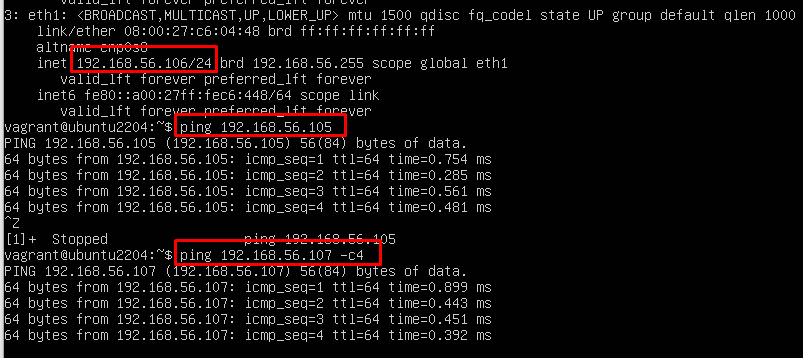
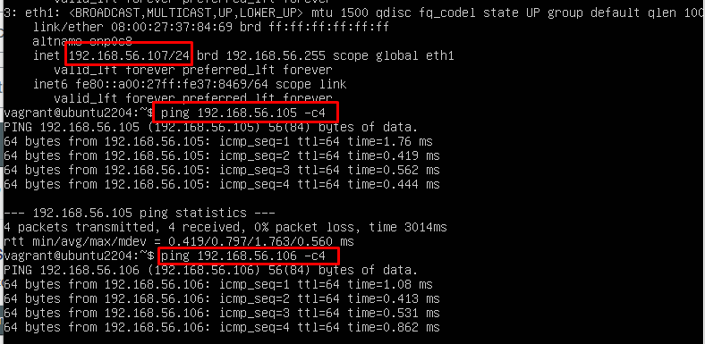

# Explicación del trabajo de ACL y bakups
*Por Marcos Rivero Zarco*

## 1. Crear las máquinas
```ruby
Vagrant.configure("2") do |config|
  
  config.vm.define "hostb" do |hostb|
    hostb.vm.box = "techchad2022/ubuntu2204"
	hostb.vm.network "private_network", ip: "192.168.56.106"
        hostb.vm.provision "shell", inline: <<-SHELL
            hostnamectl set-hostname hostb
			apt-get install -y tar
			apt-get install -y restic
			apt-get install -y rsync
        SHELL
  end

  config.vm.define "hostc" do |hostc|
    hostc.vm.box = "techchad2022/ubuntu2204"
    hostc.vm.network "private_network", ip: "192.168.56.107"
        hostc.vm.provision "shell", inline: <<-SHELL
            hostnamectl set-hostname hostc
			apt-get install -y tar
			apt-get install -y restic
			apt-get install -y rsync
        SHELL
  end
  
  config.vm.define "hosta" do |hosta|
    hosta.vm.box = "techchad2022/ubuntu2204"
	hosta.vm.network "private_network", ip: "192.168.56.105"
    hosta.vm.provision "shell", inline: <<-SHELL
            useradd -m -s /bin/bash luis
            useradd -m -s /bin/bash pedro
            useradd -m -s /bin/bash juan
			apt-get install -y tar
			apt-get install -y restic
			apt-get install -y rsync
            mkdir -p /home/luis/clientes
            chmod 750 /home/luis/clientes
            chown pedro:juan /home/luis/clientes
            hostnamectl set-hostname hosta
        SHELL
	  hosta.vm.provision "shell", path: "backup.sh", privileged: true, run: "always"
      hosta.vm.provision "shell", inline: "echo '0 9 * * * backup.sh' | crontab -"
      hosta.vm.provision "shell", path: "restic.sh", privileged: true, run: "always"
      hosta.vm.provision "shell", inline: "echo '0 9 * * * backup2.sh' | crontab -"
  end
end
```
Como sé que las máquinas no van a utilizar ninguna interfaz en tipo bridge por lo que no va a interferir con ningún equipo real, y también conozco el entorno de virtualbox con el que estoy trabajando, he decidido que las ip van a ser estáticas.

Aquí puedo comprobar que están conectadas entre ellas (a la terminal de ubuntu no le puedo cambiar el color):





Además de eso el vagrantfile también tiene en la máquina A aprovisionamientos con los comandos necesarios para crear los usuarios Luis, Juan y Pedro, el directorio y darles los permisos correspondientes.

También tengo en todas las máquinas los comandos necesarios para instalar tar, rsync y restic aunque realmente no es necesario tenerlos en todas las máquinas. 

También utilizo hostnamectl para cambiar el hostname y por último uso path para llamar a mis scripts y con cron los programo para que se inicien a las 9 de la mañana.
## 2. Crear los scripts

```shell
#!/bin/bash
backup_destination="vagrant@hostb:/home"
backup_filename="backup-$(date +\%Y\%m\%d).tar.gz"
tar -czf "$backup_filename" /home /etc
rsync -avz "$backup_filename" "$backup_destination"
```
Este script empieza guardando las variables backup_destination que es donde vamos a almacenar los backups y backup_filename que es el nombre que le vamos a poner a los bakups. El nombre consta de la fecha en la que se ha hecho.

Con tar -czf estamos creando un nuevo archivo de respaldo, comprimiendolo en gzip y dandole un nombre.

Por último con rsync estamos sincronizando las dos máquinas para que guarde los archivos de respaldo en el home del equipo hostb.

```shell
#!/bin/bash
DATE=$(date +"%Y%m%d%H%M%S") 
restic -r /home backup /home /etc --tag backup_$DATE
rsync -avz /backup/homeetc$DATE.tar.gz vagrant@hostc:/home
```

El segundo script primero almacena una variable con la fecha del día en que se ejecuta. Después crea una copia de seguridad utilizando restic y por último sincroniza el equipo a con el equipo c para guardar la copia ahí.

## ERROR 

Al hacer un up al vagrantfile da un error y es que el rsync no está funcionando, por lo que lo demás está bien, el problema es que a la hora de sincronizar con otras máquinas falla.


