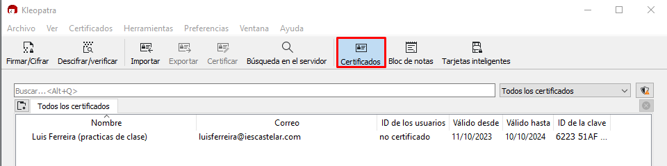
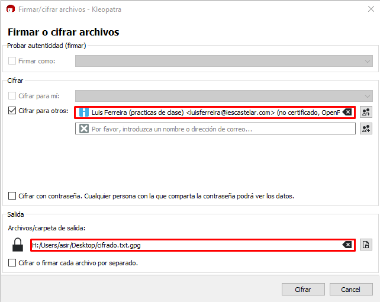
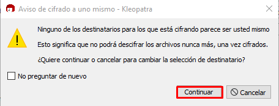

# EXAMEN MARCOS RIVERO ZARCO

## 1 - GPG
Lo primero que he hecho ha sido importar la clave pública:


Después seleccionamos con que clave y qué archivo queremos cifrar:


Por último le damos a cifrar:


## 2 - VAGRANT
El vagrantfile es el siguiente:
```ruby
Vagrant.configure("2") do |config|
    config.vm.define "vm2" do |vm2|
        vm2.vm.box = "techchad2022/ubuntu2204"
        vm2.vm.network "private_network", type: "static", ip: "192.168.33.16", virtualboxintnet: "red_controlada"
	end

    config.vm.define "vm1" do |vm1|
        vm1.vm.box = "techchad2022/ubuntu2204"
        vm1.vm.network "private_network", type: "static", ip: "192.168.33.15", virtualboxintnet: "red_controlada"
		vm1.vm.provision "shell", path: "./scripts/ACL.sh", privileged: true, run: "always"
		vm1.vm.provision "shell", path: "./scripts/backup.sh", privileged: true, run: "always"
	end
end
```
#### 2.1 ACL
```bash
mkdir -p /vagrant/clientes
useradd -m -s /bin/bash antonio
useradd -m -s /bin/bash manolo
chown antonio:manolo /vagrant/clientes
chmod 750 /vagrant/clientes
```

Este es mi scrpit : "ACL.sh".

Línea a línea lo que hace es:
    
* Crear el directorio clientes
* Añadir a los usuarios
* Cambiar al usuario y grupo propietarios del directorio
* Le da permisos de lectura, escritura y ejecución (no influye pues no es ejecutable) al usuario (Antonio) y permisos de lectura al grupo (Manolo).

#### 2.2 Backups
```bash
apt-get update
apt-get install -y sshpass
echo "0 * / 1 * * * vagrant tar -cvf clientes.tar /vagrant/clientes" >> /etc/crontab
mkdir -p /home/vagrant/.ssh
chown vagrant:vagrant /home/vagrant/.ssh
ssh-keyscan -H 192.168.33.16 >> /home/vagrant/.ssh/known_hosts
echo "0 * / 1 * * * vagrant sshpass -p 'vagrant' rsync -avz -e ssh /home/vagrant/clientes.tar vagrant@192.168.33.16:/vagrant/bakcups" >> /etc/crontab
```

Este script es el encargado de:

* Actualizar la lista de paquetes disponibles e instalar sshpass.
* Almacenar un comando que se ejecutará cada hora cuyo cometido es comprimir el directorio clientes en clientes**fecha**.tar que se almacenará en /home/vagrant (por defecto).
* Crear directorios necesarios y dar permisos correspondientes para que funcione rsync.
* Introduce el comando rsync dentro del archivo /etc/crontab configurado de tal manera que se ejecute ese comando cada hora por el usuario vagrant.

