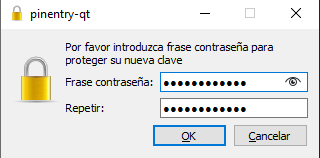

# GPG
*Por Marcos Rivero Zarco*

He hecho el trabajo por mi cuenta con dos cuentas.

## Generar las llaves
Una vez instalado gpg hay que abrir kleopatra y seguir los siguientes pasos:

## Cifrar un archivo
Cifrar un archivo es muy sencillo, se puede hacer dando click derecho o desde kleopatra.

## Envio el archivo cifrado
Me envio a mi mismo el archivo a otra cuenta mia de email.

## Descifrar el archivo
Ahora abriré una máquina virtual para descifrar el archivo.

Abro el archivo en la maquina virtual e introduzco la contraseña.

Cuando le doy a save all aparece el archivo cifrado.txt que al abrirlo contiene el mensaje original:

