# DOCUMENTACIÓN TRABAJO PFSENSE
#### *Por Marcos Rivero Zarco*

## pfSense

### Instalación
Lo primero que vamos a hacer es instalar la iso de pfSense y ejecutarla en la máquina donde queremos que se instale.

Ahora iré explicando una a una por qué elijo según que opciones (solo las importantes):
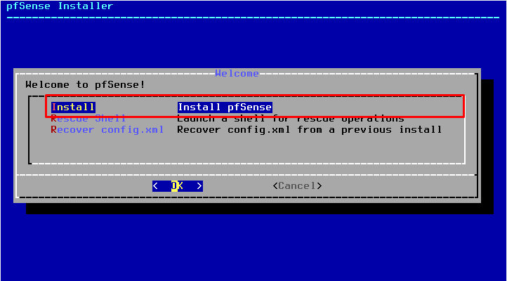

Seleccionamos instalar para comenzar la instalación.

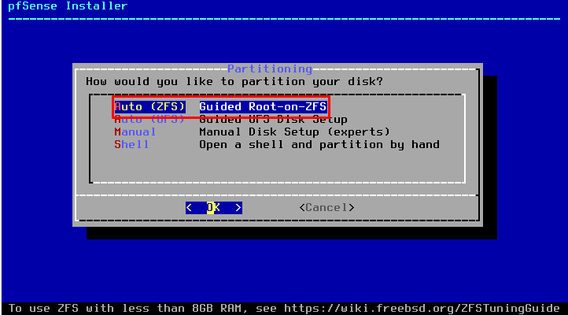

Elijo que se particione de manera automática pues en el ejercicio no pide particionado específico y además con un sistema de archivos ZFS pues el UFS se ha quedado anticuado a día de hoy.

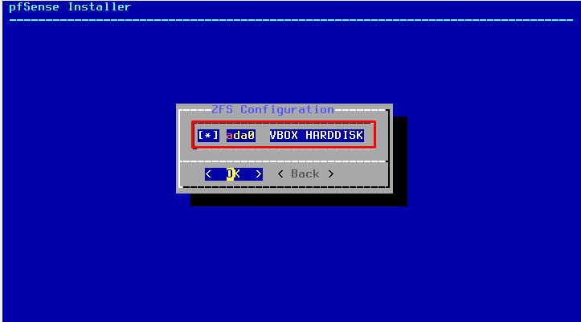

Seleccionamos el o los discos donde queremos que se realice el particionado (en este caso automático).

Lo último que queda es reiniciar el equipo.

---
### Configuración

Ahora para que todo funcione correctamente tenemos que configurar las ip de las interfaces y el servidor dhcp para que le pueda dar ip a nuestras maquinas (para ello estas tienen que estar configuradas para recibir su ip por dhcp en el vagrantfile y además deben tener 2 interfaces de red, una con host only adapter y otra con la red interna en la que también debe estar el pfsense, en mi caso se llama red_controlada).

Lo primero es asignar las interfaces WAN LAN y una opcional que sera la DMZ para que quede tal que así:

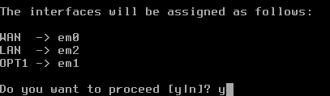

Una vez asignadas las interfaces tenemos que darles una ip, primero voy a configurar la ip de la interfaz LAN y voy a hacer que funcione como servidor dhcp para que le pueda dar ip a la máquina número 5.
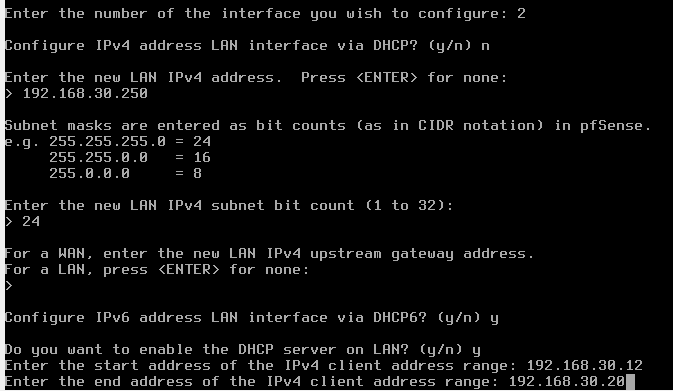

Así quedan las configuraciones de las interfaces WAN y DMZ:

DMZ:

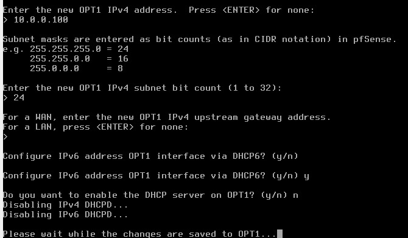

WAN:
Configurado automaticamente por DHCP.

Ahora que tenemos todas las interfaces bien configuradas tenemos vamos a meternos a la config del pfSense a través de la web mediante su ip, para ello necesitamos tener una máquina con interfaz gráfica conectada a la red LAN cuyo gateway sea la ip de pfSense. La config queda tal que así:

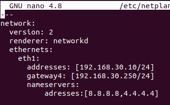

Y ahora podremos acceder al pfSense a través del navegador:

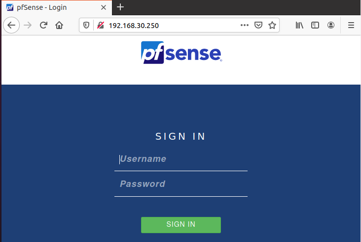

Aquí haremos una configuración bastante por defecto, a destacar tenemos la siguiente opción:

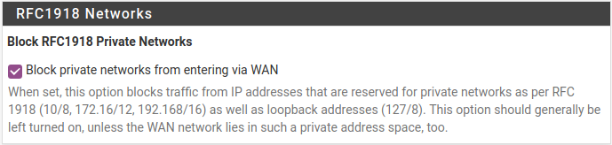

Con esto marcado no aceptamos tráfico que venga del exterior con una ip privada, lo cuál es importante teniendo en cuenta que todo el tráfico seguro de internet llegará con ips públicas.

Una vez configurado todo y teniendo como gw la ip LAN de pfSense con el WAN configurado debemos poder tener internet desde la máquina siempre que pfSense esté encendido:

[prueba](img/prueba.mp4)

## Cliente 5

En el vagrantfile la configuración del cliente 5 es la siguiente:

```ruby
	config.vm.define "vm2" do |vm2|
		vm2.vm.box = "techchad2022/ubuntu2204"
		vm2.vm.network "private_network", type: "dhcp", virtualbox__intnet: "LAN"
		vm2.vm.provision "shell", inline: <<-SHELL
		  apt-get update
		  apt-get install -y iptables
		  curl -fsSL https://get.docker.com -o get-docker.sh
		  sh get-docker.sh
		  usermod -aG docker vagrant
		  docker run -d -p 80:80 --name nginx-container nginx
          echo "<html><body><h1>Marcos Rivero Zarco</h1></body></html>" > /vagrant/index.html
	  SHELL
	end
```

Las primeras dos lineas actualizan los paquetes disponibles y descargan iptables.

La tercera linea descarga un script que se encarga de realizar la instalación de docker.

La cuarta línea lo ejecuta.

La quinta línea le da permisos a vagrant de ejecutar comandos con docker.

La sexta línea descarga nginx con docker.

La última línea se encarga de crear el index.html en /vagrant que es una carpeta compartida.

## VPN
Lo primero que hay que hacer es activar L2TP:
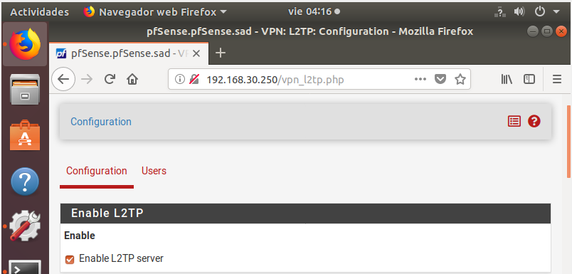

Seguimos con la config:
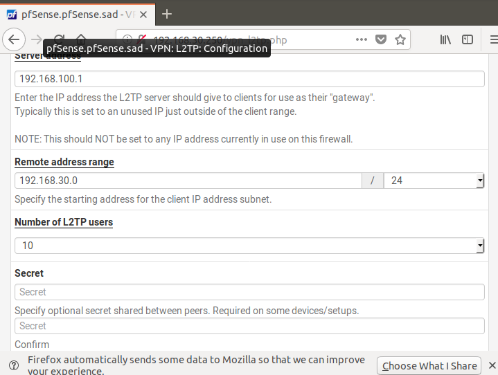

Creamos el user:
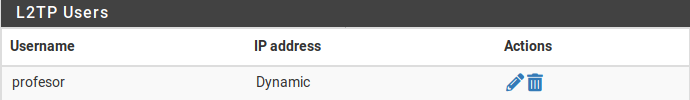

### IPsec

Configurar "Mobile Clients":

Habilitamos los mobile clients y seleccionamos local database (realmente no la usaremos):
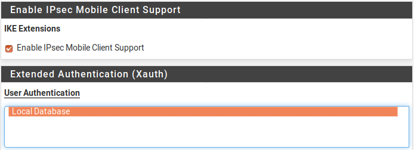

Así queda la fase 1 y 2 configuradas:
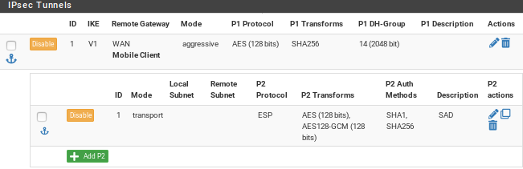

A continuación creamos la clave para todos los usuarios:
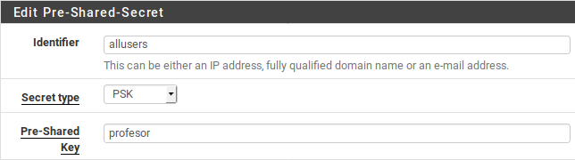

Por último abrimos los puertos del firewall:

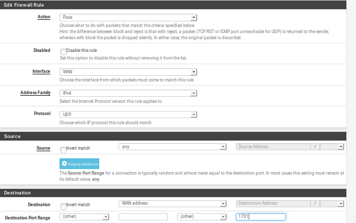

# Fuentes:
https://www.youtube.com/playlist?list=PLuMd8fg3qBxflEQOl0N2QKlYaUgD26Jvs

https://kinsta.com/es/blog/instalar-docker-ubuntu/

https://fp.josedomingo.org/seguridadgs/u03/iptables.html

https://www.redeszone.net/tutoriales/vpn/pfsense-configurar-servidor-vpn-l2tp-ipsec/