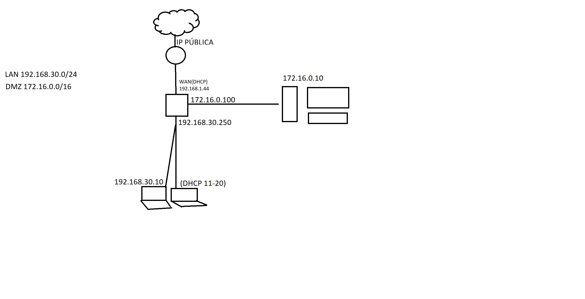
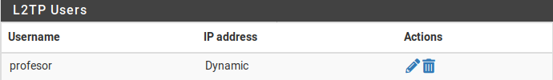

# DOCUMENTACIÓN TRABAJO PFSENSE
#### *Por Marcos Rivero Zarco*



## pfSense

### Instalación
Lo primero que vamos a hacer es instalar la iso de pfSense y ejecutarla en la máquina donde queremos que se instale.

Lo único destacable de este proceso es el sistema de fichero que se elige. En mi caso he elegido el ZFS porque el UFS (UNIX File System) está más anticuado.

---
### Configuración

Ahora para que todo funcione correctamente tenemos que primero darle un nombre a las interfaces (WAN, LAN y DMZ). Según el orden en el que tengamos las interfaces en nuestro virtualbox serán la em0, em1 o em2. En mi caso la configuración queda tal que así:


Una vez asignadas las interfaces tenemos que darles una ip, primero voy a configurar la ip de la interfaz LAN y voy a hacer que funcione como servidor dhcp para que le pueda dar ip a la máquina número 5.


Una cosa importante a tener en cuenta es que como estamos utilizando un vagrantfile y (en mi caso por lo menos) las máquinas sin interfaz gráficas son la misma box, es decir, son exactamente la misma máquina con la misma MAC el dhcp si tuviese que darle ip a más de una nos daría todo el rato la misma a no ser que le cambiásemos la MAC a alguno de los equipos.

La configuración de mi tercera máquina virtual es la siguiente:

```ruby
		vm3.vm.box = "techchad2022/ubuntu2204"
		vm3.vm.network "private_network", type: "dhcp", virtualbox__intnet: "LAN"
		vm3.vm.provision "shell", inline: <<-SHELL
		  apt-get update
		  apt-get install -y ping
		  apt-get install -y curl
		  apt-get install -y wget
	  SHELL
```

Aquí podemos comprobar que efectivamente recibe una ip dentro del rango configurado al habilitar el dhcp para ipv4 en pfsense para la interfaz LAN:


Así quedan las configuraciones de las interfaces WAN y DMZ:

DMZ:


WAN:
Configurado automaticamente por DHCP.

Ahora que tenemos todo bien configurado vamos a meternos a la config del pfSense a través de la web mediante su ip, para ello necesitamos tener una máquina con interfaz gráfica conectada a la red LAN cuyo gateway sea la ip de pfSense. La config queda tal que así:


Y ahora podremos acceder al pfSense a través del navegador:


Aquí haremos una configuración básica (hay que tocar pocas opciones), a destacar tenemos la siguiente opción:


Con esto marcado no aceptamos tráfico que venga del exterior con una ip privada, lo cuál es importante teniendo en cuenta que todo el tráfico seguro de internet llegará con ips públicas.

Una vez configurado todo y teniendo como gw la ip LAN de pfSense con el WAN configurado debemos poder tener internet desde la máquina siempre que pfSense esté encendido:

[prueba](img/prueba.mp4) (este link es un vídeo, si lo clickas te va a decir que no lo puedes visualizar pero si le das a raw te lo descarga)

## WebServer

En el vagrantfile la configuración del cliente 5 es la siguiente:

```ruby
	config.vm.define "vm2" do |vm2|
		vm2.vm.box = "techchad2022/ubuntu2204"
		vm2.vm.network "private_network", type: "static", ip:"172.16.0.10", virtualbox__intnet: "dmz"
		vm2.vm.provision "shell", inline: <<-SHELL
		  apt-get update
		  apt-get install -y iptables
		  curl -fsSL https://get.docker.com -o get-docker.sh
		  sh get-docker.sh
		  usermod -aG docker vagrant
		  docker run -d -p 80:80 --name nginx-container nginx
		  echo "<html><body><h1>Marcos Rivero Zarco</h1></body></html>" > /vagrant/index.html
	  SHELL
	end
```

Las primeras dos lineas actualizan los paquetes disponibles y descargan iptables.

La tercera linea descarga un script que se encarga de realizar la instalación de docker.

La cuarta línea lo ejecuta.

La quinta línea le da permisos a vagrant de ejecutar comandos con docker.

La sexta línea descarga nginx con docker.

La última línea se encarga de crear el index.html en /vagrant que es una carpeta compartida.

## FireWall

Vamos a hacer un filtro de tráfico para la red LAN. Primero vamos a intentar que cualquier dispositivo de la red LAN no pueda acceder a youtube.com.

Para empezar tenemos que crear un "alias" para poder utilzar el fqdn de youtube a la hora de crear la regla:


Después creamos la regla utilizando el alias:


Ahora voy a crear la regla para bloquear tráfico de luiscastelar.duckdns.org a toda la red interna excepto a un equipo. Para ello crearé un alias con el equipo al que quiero que si que se conecte y despues una regla que permita el paso a este equipo. Por último creo la regla que prohibe el paso al resto de equipos. Deberían quedar estas 3 reglas:


## VPN
Lo primero que hay que hacer es activar L2TP:


Seguimos con la config:


Creamos el user:



### IPsec

Configurar "Mobile Clients":

Habilitamos los mobile clients y seleccionamos local database (realmente no la usaremos):


Así queda la fase 1 y 2 configuradas:


A continuación creamos la clave para todos los usuarios:


Por último abrimos los puertos del firewall:


Con toda esta configuración al tratar de acceder a las páginas webs vetadas este es el resultado:


Se quedan ambas cargando infinitamente. (En la primera se ve youtube y un link porque he buscado en google youtube y después he clickado en un resultado en la segunda he puesto directamente la direccion luiscastelar.duckdns.org)

### ERROR

Después de toda esta configuración en L2TP, la fuente de por qué he configurado todo como lo he hecho está abajo. 

Este es el resultado al tratar de conectarme: 


### Wireguard
Lo primero que hay que hacer es instalarlo en el equipo que va a funcionar como servidor y generar las claves públicas y privadas del mismo:

```bash
wg genkey | sudo tee /etc/wireguard/privatekey | wg pubkey | sudo tee /etc/wireguard/publickey
```

Después tendremos un archivo de configuración en /etc/wireguard/wg0.conf en el que tendremos que proporcionar nuestra info:

**/etc/wireguard/wg0.conf** 
```
[Interface]
PrivateKey = 4CnfK1+dXB+a4u19JfWE02WZMOYDPffYe81foUW8A08=
Address = 192.168.30.250/24
ListenPort = 51820

[Peer]
PublicKey = wKbl8ycPbfsHqQp38d32yYL8xRFDsN5Rb19cwUJcWns=
AllowedIPs = 0.0.0.0/0
```

Por último instalaremos wireguard en los equipos clientes y seguiremos el mismo proceso (crear las claves y editar el archivo de configuración):

**/etc/wireguard/client.conf**
```
[Interface]
PrivateKey = ADuS0fWhjHHweQN21ct9jdfi1iDQLAcfTsqfcfNsPkM=
Address = 192.168.30.12

[Peer]
PublicKey = wKbl8ycPbfsHqQp38d32yYL8xRFDsN5Rb19cwUJcWns=
Endpoint = 192.168.30.250:51820
AllowedIPs = 0.0.0.0/0
```
Después de configurarlo todo correctamente tanto en el servidor como en el cliente tenemos que ejecutar el siguiente comando:

```
sudo wg-quick up <wg0/client.conf>
```

(Se pondrá wg0 o client.conf según la máquina en la que estemos, primero la ejecutaremos en el server)

Todo esto tampoco funciona, se que en las capturas aparece la ip 192.168.30.250 que no es la correcta pero cambiándola a la ip WAN también tengo algún error.

Te dejo la documentación igualmente de ambas VPN, para dejar constancia de que lo he intentado.
---

### iptables
Ahora mediante iptables voy a hacer que el primer equipo de la red LAN no pueda acceder al segundo con el siguiente comando:

```Bash
sudo iptables -A OUTPUT -d 192.168.30.12 -j DROP
```
---

# Fuentes:
https://www.youtube.com/playlist?list=PLuMd8fg3qBxflEQOl0N2QKlYaUgD26Jvs

https://kinsta.com/es/blog/instalar-docker-ubuntu/

https://fp.josedomingo.org/seguridadgs/u03/iptables.html

https://www.redeszone.net/tutoriales/vpn/pfsense-configurar-servidor-vpn-l2tp-ipsec/

Ayuda de bing AI.