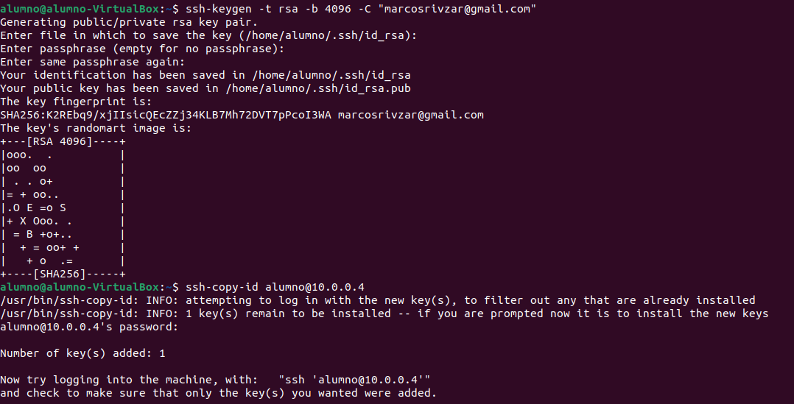
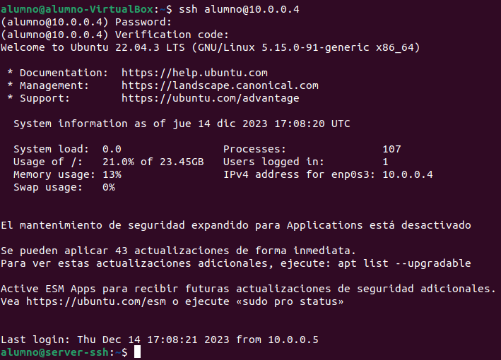
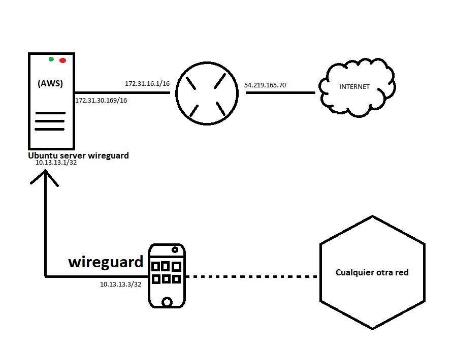

# DOCUMENTACIÓN TRABAJO 
#### *Por Marcos Rivero Zarco*

## Server SSH

### No root / no contraseña
Lo primero que tenemos que hacer con el servidor ssh es securizarlo pues, por el momento, puedo iniciar sesión con root y utilizando contraseñas. 

El objetivo es no permitir iniciar sesión con el usuario root y solo poder conectarnos a la máquina mediante el uso de claves público-privadas y no por contraseñas.

---
Esto es tan sencillo como editar un fichero y reiniciar el servicio. Aunque antes de eso he compartido mi clave pública mediante el uso de contraseña al servidor ssh (no por nada, si no porque es más cómodo) antes de restringirlo.




Por último tenemos que reiniciar el servicio (systemctl restart sshd) y comprobar que efectivamente ya no podemos conectarnos usando contraseñas ni con la cuenta root:


(Aunque pida la contraseña la introduces correctamente y te dice permission denied y en caso de iniciar como alumno como compartí mi clave pública con el server ssh ni si quiera pide contraseña, simplemente se conecta).

### Fail2ban
Lo primero que hay que hacer después de instalar el servicio es meternos al archivo de configuración (/etc/fail2ban/jail.conf):


También hay que reiniciar el servicio (fail2ban.service).

Y comprobamos que efectivamente tras fallar 2 veces nos banea la ip por 30 segundos en el 3er intento:


### Doble factor de autenticación.
Para hacer esto tenemos que volver a activar las contraseñas y desactivar que se pueda acceder mediante claves públicas.

Lo primero es instalar el paquete del módulo PAM "libpam-google-authenticator -y" y añadir la línea

```
auth required pam_google_authenticator.so
```

dentro del archivo "/etc/pam.d/sshd".

Después hay que editar el parámetro de "KbdInteractiveAuthentication" dentro del sshd_config, ponerlo en "yes".

Después reiniciamos el servicio sshd.

Tras poner el comando google-authenticator y poner yes a todas las opciones que aparecen y -1 cuando nos pide un código para skipear he escaneado el código qr y se me ha agregado en el móvil en el apartado contraseñas un apartado que genera códigos cada 30 segundos (pincha [aquí](https://youtube.com/shorts/YZjsm88riQU) para ver a lo que me refiero).

Este es el código qr que me ha generado:


Y aquí se ve como a parte de la contraseña ahora me pide también un código de verificación (que es el que se me genera cada 30 segundos):



### VPN con WireGuard


Lo primero que hay que hacer es alojar una máquina virtual en la web, yo he optado por hacerlo en AWS de forma gratuita y he utilizado la versión 20.04 de ubuntu server (sigue teniendo actualizaciones hasta abril).

Una vez tenemos la máquina que vamos a utilizar lanzada y nos hemos conectado a ella instalamos los paquetes docker.io docker-compose.

Una vez tenemos estos paquetes instalados haremos un archivo secreto donde guardaremos información como puertos y contraseñas y lo utilizaremos para poder poner estos datos tan peligrosos en nuestro docker-compose.yaml:


Después hacemos el up:


Al hacer el docker-compose logs comprobamos que todo funciona correctamente:


Como tengo configurados 2 clientes me salen dos códigos qr, aquí está uno de ellos:


Ahora voy a conectarme con mi móvil a través de la app creando el túnel con el qr. Prueba de que funciona [aquí](https://youtube.com/shorts/lu9KGzLLAxI)

## Fuentes

https://www.arsys.es/blog/instalar-fail2ban

https://www.zonasystem.com/2022/06/segundo-factor-de-autenticacion-2fa-en-conexiones-ssh.html

https://www.youtube.com/watch?v=G_Pv9XEzfUY

Ayuda de la IA de Bing.


