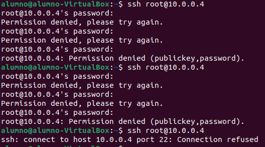

# DOCUMENTACIÓN TRABAJO PFSENSE
#### *Por Marcos Rivero Zarco*

## Server SSH
Lo primero que tenemos que hacer con el servidor ssh es securizarlo pues, por el momento, puedo iniciar sesión con root y utilizando contraseñas. 

El objetivo es no permitir iniciar sesión con el usuario root y solo poder conectarnos a la máquina mediante el uso de claves público-privadas y no por contraseñas.

### No permitir iniciar sesión a root.
Esto es tan sencillo como editar un fichero y reiniciar el servicio, aquí dejo el proceso:

Quiero recalcar que todo este proceso lo estoy haciendo en la configuración ssh del servidor a través de la máquina cliente usando la cuenta de root:

Por último tenemos que reiniciar el servicio y comprobar que efectivamente, ya no podemos iniciar sesión en el server a través de ssh con la cuenta root:

### No permitir contraseñas.

