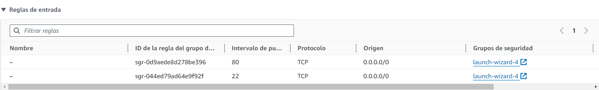
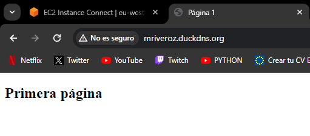
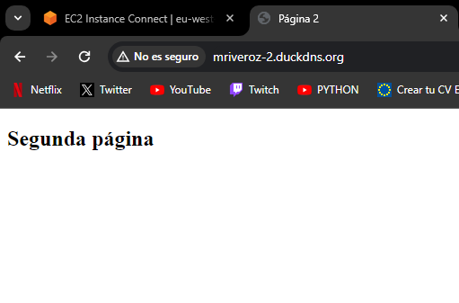

# DOCUMENTACIÓN TRABAJO UT5 (PROXY INVERSO)
#### *Por Marcos Rivero Zarco*

## Mapa de red del trabajo

---
Voy a explicar como he hecho el trabajo dividiendolo en diferentes pasos:

## LANZAR INSTANCIA EC2 E INSTALAR PAQUETES
Lo primero que he hecho ha sido con mi cuenta (ya creada para la práctica anterior). He lanzado una nueva instancia EC2.

Después he abierto el puerto 80 para poder recibir peticiones http y que nginx las rediriga a cada uno de los docker según el subdominio al que se diriga la petición. También he instalado el paquete de nginx.

Ahora me aseguraré de que el puerto 80 esté abierto para que permita el tráfico http:




## ÁRBOL DE DIRECTORIOS
Así quedan los directorios del proyecto:

/proyecto

├── mriveroz

│   └── index.html

├── mriveroz-2

│   └── index.html

├── nginx

│   └── conf.d

│       └── mriveroz.conf

│       └── mriveroz-2.conf

│     

└── docker-compose.yml

## CONTENIDO DE LOS ARCHIVOS DE CONFIGURACIÓN

Este es el contenido del .yml:
```yml
version: '3'

services:
  nginx:
    image: nginx
    ports:
      - "80:80"
    volumes:
      - ./nginx/conf.d:/etc/nginx/conf.d
      - ./mriveroz:/usr/share/nginx/html/mriveroz
      - ./mriveroz-2:/usr/share/nginx/html/mriveroz-2
    restart: always
```

Este es el contenido de los .conf:

mriveroz.conf
```yml
server {
    listen 80;
    server_name mriveroz.duckdns.org;

    location / {
        root /usr/share/nginx/html/mriveroz;
        index index.html;
    }
}
```

mriveroz-2.conf
```yml
server {
    listen 80;
    server_name mriveroz2.duckdns.org;

    location / {
        root /usr/share/nginx/html/mriveroz-2;
        index index.html;
    }
}
```

Por supuesto los dos subdominios deben estar apuntando a la ip de la máquina de aws. Este es el resultado final:



