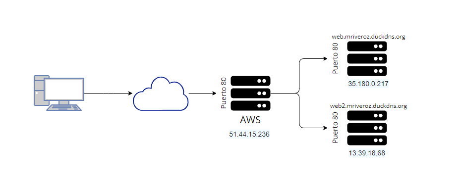
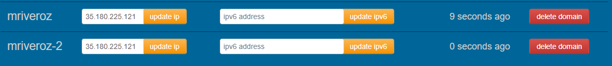

# DOCUMENTACIÓN TRABAJO UT5 (PROXY INVERSO)
#### *Por Marcos Rivero Zarco*

## Mapa de red del trabajo

---
Voy a explicar como he hecho el trabajo dividiendolo en diferentes pasos:

## LANZAR INSTANCIA EC2 E INSTALAR PAQUETES
Lo primero que he hecho ha sido con mi cuenta (ya creada para la práctica anterior). He lanzado una nueva instancia EC2.

Después he abierto el puerto 80 para poder recibir peticiones http y que nginx las rediriga a cada uno de los docker según el subdominio al que se diriga la petición. También he instalado el paquete de nginx.

Para abrir el puerto 80 he instalado el paquete ufw ya que es un software que facilita mucho la gestión de reglas en sistemas basados en linux. Con este paquete solo usando dos comandos tendremos el puerto 80 abierto:

```bash 
sudo ufw allow 80
```

```bash 
sudo ufw enable
```

Para comprobar el estado:

```bash
sudo ufw status
```

Si todo ha salido correctamente este será el resultado:

To                         Action      From
--                         ------      ----
80                         ALLOW       Anywhere                  
80 (v6)                    ALLOW       Anywhere (v6)     

(Permite el tráfico del puerto 80 tanto para ipv4 como para ipv6).

## CONFIGURAR NGINX
He añadido las siguientes líneas al archivo de configuración de nginx: 

```c
server {
    listen 80;

    server_name mriveroz.duckdns.org;

    location / {
        proxy_pass http://localhost:8001;
        proxy_set_header Host $host;
        proxy_set_header X-Real-IP $remote_addr;
    }
}

server {
    listen 80;

    server_name mriveroz1.duckdns.org;

    location / {
        proxy_pass http://localhost:8002;
        proxy_set_header Host $host;
        proxy_set_header X-Real-IP $remote_addr;
    }
}
```

He guardado el archivo y reiniciado el servicio.

## INSTALAR Y CONFIGURAR DOCKER
He seguido la documentación oficial de docker para instalar el paquete tanto de docker como de docker-compose.

Una vez instalados me pongo a configurar 2 contenedores (1 para cada una de las páginas).

Una vez he puesto toda la config necesaria en cada uno de los yaml hago docker-compose en los dos archivos.

## CONFIGURAR LOS DOS SUBDOMINIOS

Por último solo queda asegurarnos de que los dos subdominios apuntan a la ip de mi máquina en aws:



## CORRECCIÓN APERTURA DE PUERTOS

Parece que la regla del firewall no ha sido suficiente así que he abierto los puertos a mano en aws con una regla de entrada de esa máquina desde cualquier ip por el puerto 80.

Ahora sí que funciona, ambas páginas cargan. Solo queda diferenciarlas con diferentes index.html porque ahora mismo solo se ve la pantalla de bienvenida de nginx en ambas.

Para ello he tenido que cambiar la configuración de nginx añadiendo las siguientes líneas (para el caso de mriveroz.duckdns.org):

```c
server {
  listen 80;
  server_name mriveroz.duckdns.org;
  root /home/ubuntu/mriveroz;
  index index.html;
}
```

El index.html lo tengo creado dentro de la carpeta mriveroz que se encuentra en la ruta especificada. Para el mriveroz-2.duckdns.org he hecho lo mismo. El resultado es el siguiente:

