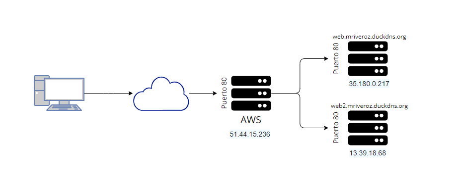
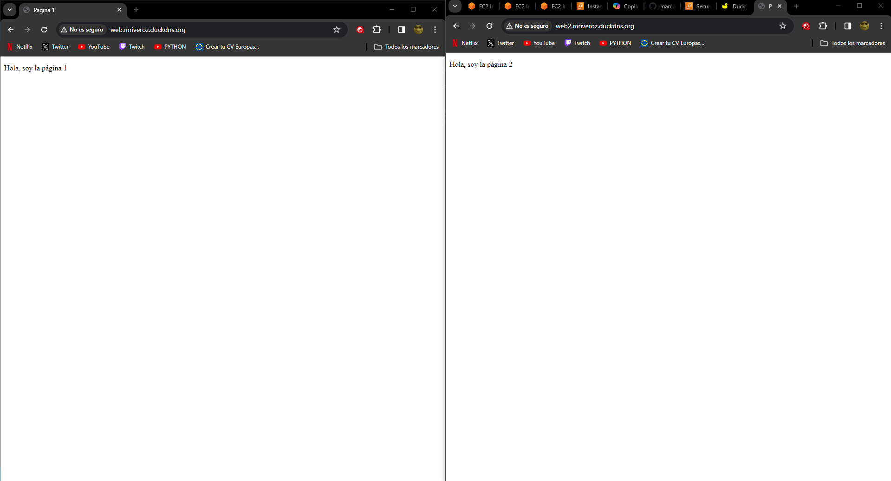

# DOCUMENTACIÓN TRABAJO UT5 (PROXY INVERSO)
#### *Por Marcos Rivero Zarco*

## Mapa de red del trabajo

---

Lo primero que he tenido que hacer ha sido hostear 3 máquinas en AWS, las 3 con el puerto 80 abierto. Una de ellas es la que tiene el proxy instalado (NGINX). Dentro de /etc/nginx/nginx.conf he tenido que escribir lo siguiente en el apartado http:

```
server {
    listen 80;
    server_name web.mriveroz.duckdns.org;

    location / {
        proxy_pass http://35.180.0.217;
        proxy_set_header Host $host;
    }
}

server {
    listen 80;
    server_name web2.mriveroz.duckdns.org;

    location / {
        proxy_pass http://13.39.18.68;
        proxy_set_header Host $host;
    }
}
```

Estas líneas redirigen el tráfico según la url escrita a mis otras dos máquinas de aws, en caso de que escribas web te llevará a la que tiene el index.html en el que pone Hola soy la página 1 y en caso de que escribas web2 te mandará a la otra.

El tráfico que tiene .mriveroz.duckdns.org se dirige a la máquina con el proxy inverso porque así lo he configurado en duckdns.


Las máquinas a las que redirigo el tráfico tienen instalado un apache2. En los index he puesto frases diferenciadas para que se pueda distinguir que efectivamente son páginas distintas:


